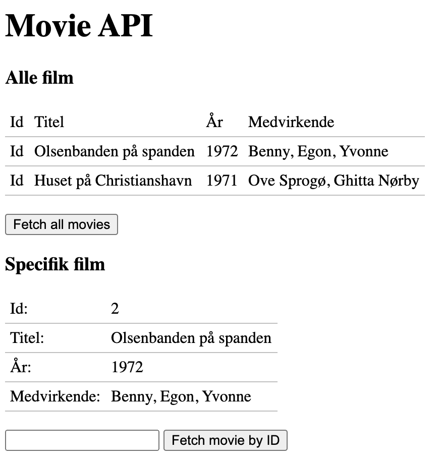

<!-- REMOVE ME: Setting isSP ensures this pages gets added to the list of Studypoint exercises -->

## Part-1 Complete all exercises (according to your colour level) from this week

<!-- REMOVE ME: The tag below will insert all day-exercises given for this week -->
<!-- REMOVE ME: PeriodFolder and weekFolder MUST match the real folder names -->

<!--PeriodExercises Flow-1/week3 PeriodExercises-->

## Part-2

### Add a JavaScript-driven frontend to your REST-API

Begin building a front-end to the Movie REST API from earlier this week. Eventually we want to fetch data from the Movie API, but since we have postponed fetching api-data with javascript until Monday, the first iteration of the page only contains the outline of the user interface in pure html and css:

Make sure to deploy via Travis and not manually.

